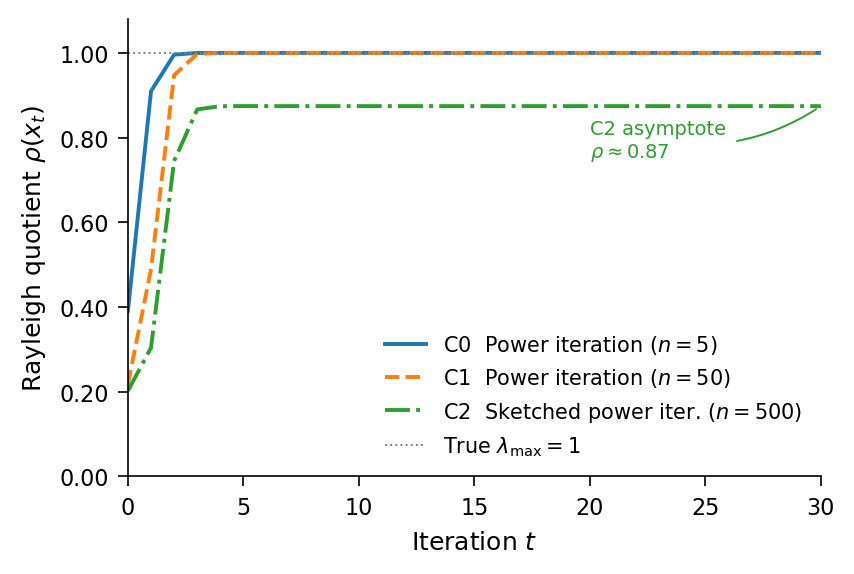
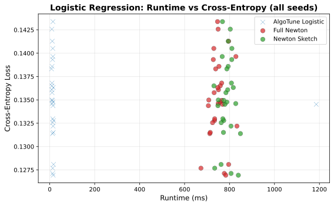
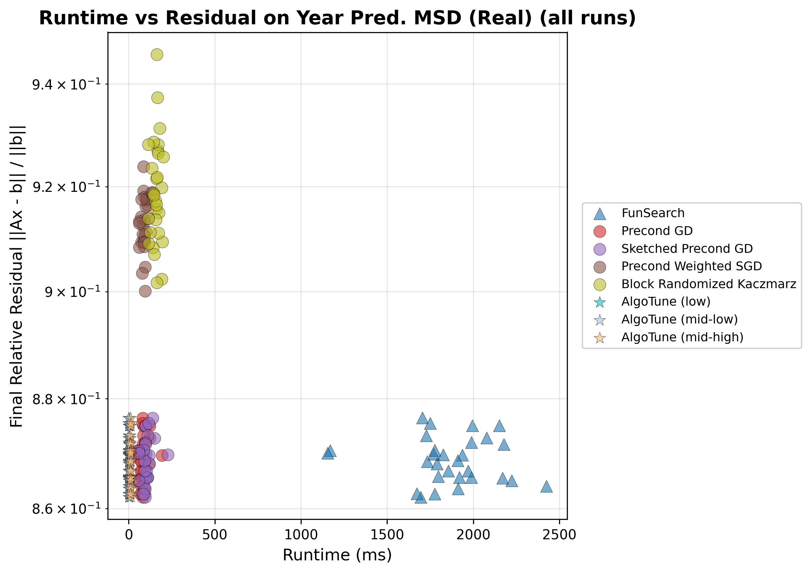
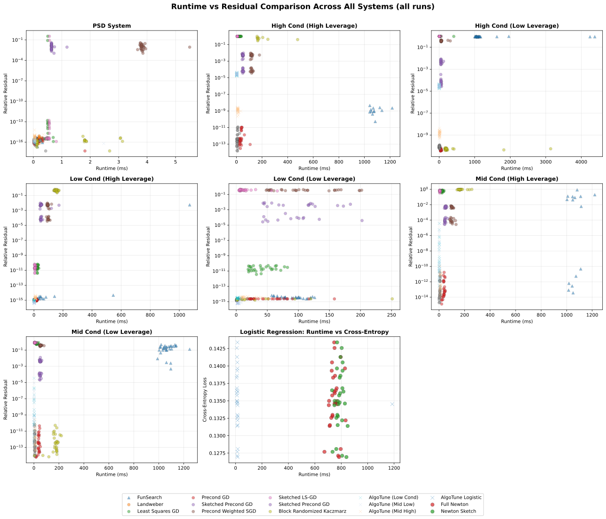

***Figure 1:** Rayleigh quotient ρ(xₜ) over iterations for algorithms discovered by RL4RLA on the symmetric PSD eigenvalue problem. C0 and C1 rediscover exact power iteration on small (n=5) and medium (n=50) systems, converging to the true λₘₐₓ=1. C2 rediscovers sketched power iteration on a large system (n=500), converging to ρ≈0.87 — the expected asymptote for a sketched variant trading accuracy for computational efficiency. All results are consistent across 5 independent seeds.*

***Figure 2:** Runtime vs. residual comparison on the logistic regression system. AlgoTune achieves significantly faster runtimes by directly invoking an optimized library solver (sklearn's LogisticRegression), while RL4RLA-discovered methods (Full Newton, Newton Sketch) require longer runtimes. All three methods achieve similar final residuals within the narrow range 0.1275–0.1425, indicating that in this setting AlgoTune's speed advantage comes entirely from library-level exploitation rather than algorithmic superiority. This illustrates the fundamental difference between the two approaches: AlgoTune optimizes implementation, while RL4RLA searches over algorithmic structure.*

***Figure 3:** Runtime vs. final relative residual on YearPredictionMSD (real data). Each method is run 30 times with different random seeds; each point corresponds to one run.*

***Figure 4:** Runtime vs. residual comparison between RL4RLA-discovered algorithms and AlgoTune across 5 system families (3×3 grid, each subplot representing one system configuration). RL4RLA methods (Full Newton, Newton Sketch) consistently achieve residuals below 10⁻¹¹. AlgoTune variants (Mid Low, Mid High, Logistic) achieve faster runtimes in some regimes, notably by invoking optimized library solvers in the logistic setting, but at significantly higher residuals under ill-conditioning and high leverage variance. This illustrates that implementation-level optimization cannot compensate for structural algorithmic limitations.*
